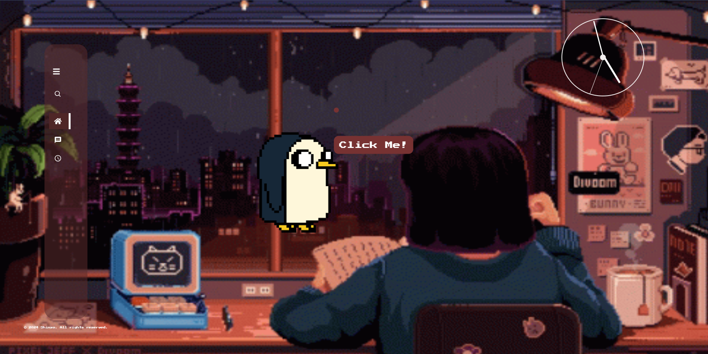

# Shinzo
<h2>Description:</h2>
<p>Created a React study space with dynamic features, music, and deployed on Vercel.

 Implemented Framer Motion Library for animations and Material UI for icons. 

 Utilised Redux for state management of tasks and timer.</p>

 <h2>Current Status:</h2>
 <p>Working on setting up a backend server, for keeping the record of the users and their personal records created on the website.</p>
<h2>To use it:</h2>
<ul>
 <li>Create a new project using </li> 

 ```
npm create vite@latest
```
<li> To install the necessary node modules  </li>

```
npm install
```
<li>To start the development server </li>

```
npm run dev
```
<li>To install Material UI components</li>

```
 npm install @mui/material @emotion/react @emotion/styled
```
<li>To implement the Framer </li>

```
 npm install framer-motion
```
</ul>

